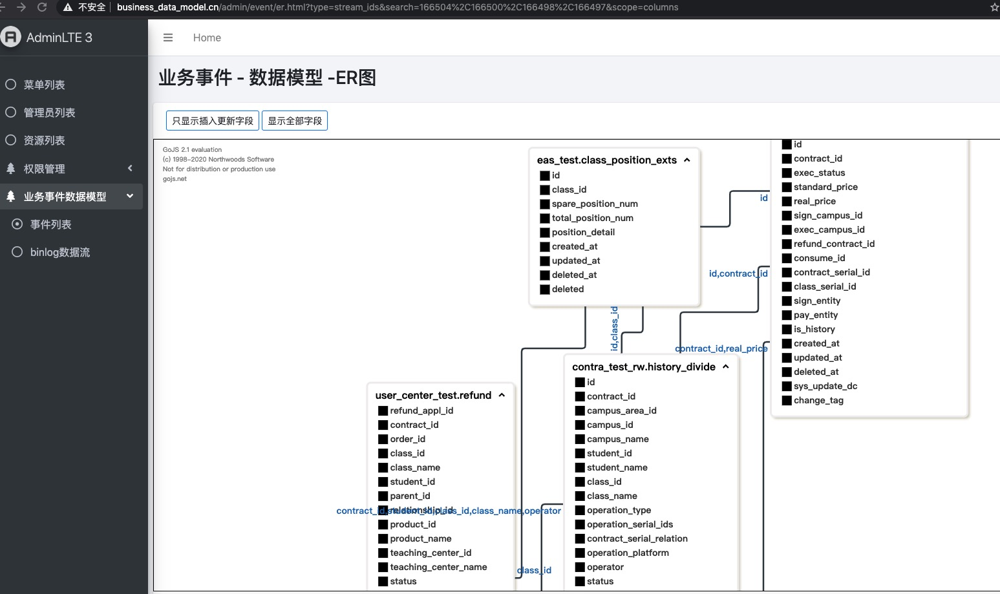
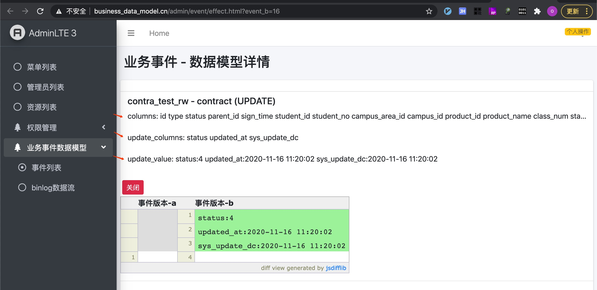

# mysql-binlog解析与记录

组合mysql-binlog，生成api接口文档，知其影响的库表。

## 名词解释

mysql binlog事件类型：增、删、改操作 数据流： mysql-binlog row模式下的每一行增、删、更数据。 一个数据流包含：库名，表名，所有字段名，mysql事件类型，实现修改的字段和值 项目事件：
理解项目中的一触发点，如一个接口，一个定时任务等，一个项目事件包含一到多数据流组成。 数据模型： 同一项目事件中多个数据流库表间的关联关系

## 目标

管理业务事件和数据模型，清楚直接的了解系统有哪些重要的事件， 每个事件影响哪些数据。  
新渠道新接口对比原接口数据异同。  
系统重构新接口或新版本的数据模型原与模型异同对比。等。

## mysql binlog事件类型

消费mysql-binlog会有多种event_type（mysql事件类型），如ROTATE_EVENT，FORMAT_DESCRIPTION_EVENT，TABLE_MAP_EVENT等， 本项目中关注
WRITE_ROWS_EVENT（增），UPDATE_ROWS_EVENT（改），DELETE_ROWS_EVENT（删） 三个事件。

## 生成数据流

以mysql主从同步技术为基础，获得mysql所以增、删、更数据，存储到event_stream表中。 数据流的数据从mysql-binlog中来。

## 项目事件- 组合数据流

勾选一到多个数据流，生成项目事件，此事件是项目中的一个动作。

## 项目事件查看，事件数据模型ER图

把项目事件包含的库.表之间的关系以图的形式表现出来。 等同数据库管理工具如navicat,dbeaver等工具。

## 多版本事件数据异同对比

时间推移功能迭代， 事件（接口）的操作有所变更，如增了新的字段等。 可对比同事件不同版本之间的数据异同

## 数据流与事件数据异同对比

选择任意数据流和事件进行对比，和多版本事件对比功能相同。

## 异同对比图型展示
数据模型详情展示   
  
数据模型异同对比  
  
数据模型异同对比 - 新增元素  
  
数据模型异同对比 - 变更元素  
  

## 总结

一个(非查询类)接口被请求，就会新增数据、更改数据、删除数据操作。不管接口经过多秒逻辑处理，都是为了数据持久化，落实到库。   
所以一个非查询类接口的增、删、更都会在mysql-binlog中体现。  
事件数据模型管理以mysql-binlog为基础，实现数据模型展示与对比，数据表之间的ER关系图。  
事件数据模型管理有利于项目数据模型的维护、迭代和说明系统的关键功能实现。  

